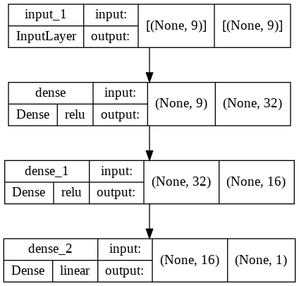

# Diamonds

## 1. Summary
This project analyses diamonds by their cut, color, clarity, price, and other attributes and predict their price using feedforward neural network.

## 2. Code and Resources Used
*	This project is created using Google Colab as the main IDE.
*	Main Packages: Pandas, Scikit-learn and TensorFlow Keras.
*	This dataset has been taken from Kaggle. 
Kaggle link: https://www.kaggle.com/datasets/shivam2503/diamonds

## 3. Methodology
### 3.1. Data Pipeline
The data is first loaded, visualize, and pre-processed by checking null values and removing unwanted features. Then data perform numerical encoding for features because its rank based. Finally, the data split into train size of 80% and test size of 20% respectively.

### 3.2. Model Pipeline
Feedforward neural network is used for this regression problem. The data have been standardized during this phase. The figure below shows the structure of the model.

The model is trained with a batch size of 8 and for 20 epochs. The MAE achieved 409.2519. The training and the validation loss were 654319.6875 and 1176431.6250 respectively. The two figures below show the graph of the training and validation loss and training and validation MAE.

## 4. Results
Upon evaluating the model with test data, the model obtains the following test results, as shown in the figure below.

